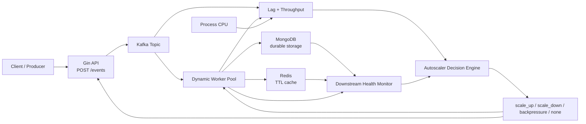
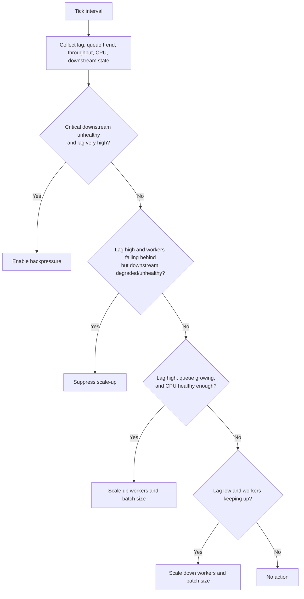

# Autoscaler

This project is a queue-driven autoscaler demo that accepts events over HTTP, writes them to Kafka, processes them with a worker pool, persists them to MongoDB, caches them in Redis, and uses downstream health as part of the scaling decision pipeline.

## Architecture



The runtime flow is:

1. `POST /events` accepts an event and writes it to Kafka.
2. Workers fetch Kafka messages in batches.
3. Each batch is decoded into events.
4. The batch is stored durably in MongoDB with `insert_many`.
5. Each event is cached in Redis with a configurable TTL.
6. Throughput, Kafka lag, CPU, and downstream health are evaluated once per tick.
7. The autoscaler chooses one action:
   - `scale_up`
   - `scale_down`
   - `backpressure`
   - `none`

## Components

### API

- `POST /events`
  - accepts an event payload
  - assigns an ID and timestamp if they are missing
  - writes the event to Kafka
- `GET /healthz`
  - returns process health and whether backpressure is enabled
- `GET /internal/status`
  - returns the latest autoscaler snapshot, including worker state, lag, throughput, and downstream status

### Workers

Workers are managed dynamically. They scale worker count and batch size based on autoscaler decisions.

Each worker batch is processed by a real downstream processor:

- MongoDB is the primary durable store
- Redis stores cached event payloads

### Downstream health

Downstream health is tracked per dependency key:

- `kind`
- `name`
- `operation`

Current built-in downstreams:

- `mongodb/mongodb/insert_many`
- `mongodb/mongodb/ping`
- `redis/redis/set_batch`
- `redis/redis/ping`
- `worker/worker-processor/process_batch`

Each dependency has a policy:

- `critical`
  - may suppress scale-up
  - may trigger backpressure
- `protective`
  - may suppress scale-up
  - cannot trigger backpressure on its own
- `observe_only`
  - visible in status and logs
  - ignored by decisions

Health state is derived from:

- latency thresholds
- error rate thresholds
- minimum samples
- hysteresis windows

## Configuration

The app loads configuration from:

1. the file pointed to by `AUTOSCALER_CONFIG`, or
2. `config.yaml` if it exists, or
3. built-in defaults

Example local config is in [config.example.yaml](C:/Users/Owner/GolandProjects/autoscaler/config.example.yaml).
Docker uses [config.docker.yaml](C:/Users/Owner/GolandProjects/autoscaler/config.docker.yaml).

Important config areas:

- `api`
  - server bind address
- `kafka`
  - brokers, topic, consumer group
- `workers`
  - worker and batch limits
- `processing`
  - Redis cache key prefix and TTL
- `mongodb`
  - connection, database, collection, health-check interval, policy
- `redis`
  - connection, health-check interval, policy
- `downstream`
  - degraded/unhealthy thresholds, hysteresis, observe-only mode, decision cooldown
- `scaling`
  - tick interval, lag thresholds, CPU thresholds, queue growth window

## Running locally

### With Docker

```bash
docker compose up --build
```

This starts:

- Kafka
- Kafka topic initialization
- MongoDB
- Redis
- the autoscaler service

The autoscaler API will be available on `http://localhost:8080`.

### Without Docker

1. start Kafka, MongoDB, and Redis yourself
2. copy `config.example.yaml` to `config.yaml`
3. adjust addresses if needed
4. run:

```bash
go run ./cmd/autoscaler
```

## Event model

Example event payload:

```json
{
  "id": 1001,
  "user_id": "user-42",
  "action": "click",
  "element": "checkout-button",
  "duration": 0.214,
  "timestamp": "2026-04-25T18:00:00Z"
}
```

If `id` or `timestamp` is omitted, the API fills them in automatically.

## Decision pipeline



The scaler uses:

- Kafka consumer lag
- queue growth trend
- incoming throughput
- processed throughput
- process CPU
- downstream decision status

Decision rules are policy-aware:

- critical unhealthy downstream + very high growing lag + falling behind => `backpressure`
- protective or critical degraded/unhealthy downstream + high growing lag => suppress `scale_up`
- low lag + stable queue + workers keeping up => `scale_down`

## Internal status

`GET /internal/status` returns the latest computed runtime snapshot, including:

- queue lag
- CPU usage
- backpressure state
- workers and batch size
- latest throughput snapshot
- chosen decision action and reason
- selected downstream decision status
- all known downstream statuses

This endpoint is intended for internal debugging and operator visibility.

## Notes

- Metrics export is intentionally not included.
- Downstream identity is explicit. The code decides which dependency is being measured by naming it at the call site.
- The current project uses MongoDB and Redis as real downstreams out of the box, and the downstream framework can be extended for other databases or APIs later.
