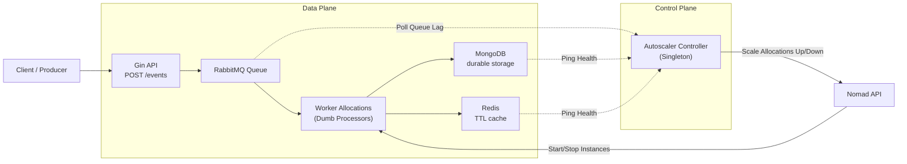
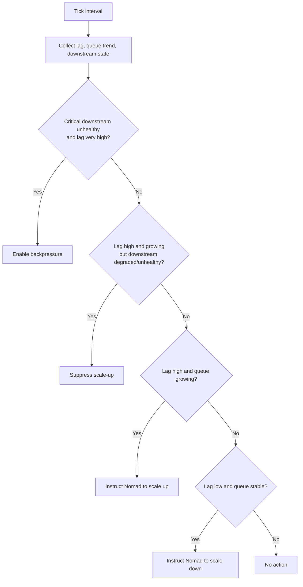

# Autoscaler

This project is a queue-driven autoscaler demo that accepts events over HTTP, writes them to RabbitMQ, processes them with a horizontally scalable worker pool, persists them to MongoDB, caches them in Redis, and uses downstream health as part of the scaling decision pipeline.

The architecture follows an "External Autoscaler" pattern, strictly separating the control plane (the scaling logic) from the data plane (the event processors).

## Architecture



The runtime flow is:

1. `POST /events` accepts an event and writes it to RabbitMQ.
2. The Nomad orchestrator runs N instances of the Worker application.
3. Workers fetch RabbitMQ messages in batches using a fixed pool of goroutines.
4. Each batch is decoded into events.
5. The batch is stored durably in MongoDB with `insert_many`.
6. Each event is cached in Redis with a configurable TTL.
7. Separately, the Autoscaler Controller evaluates RabbitMQ lag and downstream health once per tick.
8. The Controller instructs Nomad to adjust the Worker instance count via the Nomad API.

## Components

### API (Worker)

- `POST /events`
  - accepts an event payload
  - assigns an ID and timestamp if they are missing
  - writes the event to RabbitMQ
- `GET /healthz`
  - returns process health

### Workers

Workers are purely data-plane processing units. They boot up with a fixed, static pool of goroutines and process batches as quickly as physical limits allow. 

Each worker batch is processed by a downstream processor:

- MongoDB is the primary durable store
- Redis stores cached event payloads

Workers do not make scaling decisions or track system-wide throughput. They rely entirely on Nomad for horizontal scaling.

### Controller (The Brain)

The Controller is a singleton service (`count = 1` in Nomad). It executes the decision pipeline on a configurable interval. It reads the total lag from RabbitMQ and pings downstream databases to ensure they can handle increased load before telling Nomad to spin up new workers.

### Downstream health

Downstream health is tracked by the Controller per dependency key:

- `kind`
- `name`
- `operation`

Current built-in downstreams:

- `mongodb/mongodb/ping`
- `redis/redis/ping`

Each dependency has a policy:

- `critical`
  - may suppress scale-up
  - may trigger backpressure
- `protective`
  - may suppress scale-up
  - cannot trigger backpressure on its own
- `observe_only`
  - visible in status and logs
  - ignored by decisions

Health state is derived from:

- latency thresholds
- error rate thresholds
- minimum samples
- hysteresis windows

## Configuration

The app loads configuration from:

1. the file pointed to by `AUTOSCALER_CONFIG`, or
2. `config.yaml` if it exists, or
3. built-in defaults

Important config areas:

- `api`
  - server bind address
- `rabbitmq`
  - broker url, queue name
- `workers`
  - max batch size limits
- `processing`
  - Redis cache key prefix and TTL
- `mongodb`
  - connection, database, collection, health-check interval, policy
- `redis`
  - connection, health-check interval, policy
- `downstream`
  - degraded/unhealthy thresholds, hysteresis, observe-only mode, decision cooldown
- `scaling`
  - tick interval, lag thresholds, queue growth window
- `nomad`
  - api address, job name, target task group, max scale limit

## Running locally

1. Start your local Nomad agent.
2. Start RabbitMQ, MongoDB, and Redis.
3. Submit the Nomad job to deploy both the Controller and the initial Worker allocation:

```bash
nomad job run nomad.job.hcl
```

Alternatively, you can compile and run the binaries directly for testing outside of Nomad:

```bash
go build -o worker.exe ./cmd/worker
go build -o controller.exe ./cmd/controller
./worker.exe
./controller.exe
```

## Event model

Example event payload:

```json
{
  "id": 1001,
  "user_id": "user-42",
  "action": "click",
  "element": "checkout-button",
  "duration": 0.214,
  "timestamp": "2026-04-25T18:00:00Z"
}
```

If `id` or `timestamp` is omitted, the API fills them in automatically.

## Decision pipeline



The scaler uses:

- RabbitMQ consumer lag
- queue growth trend
- downstream decision status

Decision rules are policy-aware:

- critical unhealthy downstream + very high growing lag => `backpressure`
- protective or critical degraded/unhealthy downstream + high growing lag => suppress `scale_up`
- low lag + stable queue => `scale_down`

## Notes

- CPU usage has been explicitly removed from the decision engine to protect against infinite scaling in the event of memory leaks or application-level CPU loops.
- Downstream identity is explicit. The code decides which dependency is being measured by naming it at the call site.
- The Controller is designed as a strict singleton to completely eliminate race conditions without the need for distributed locks like Redis or Consul.
